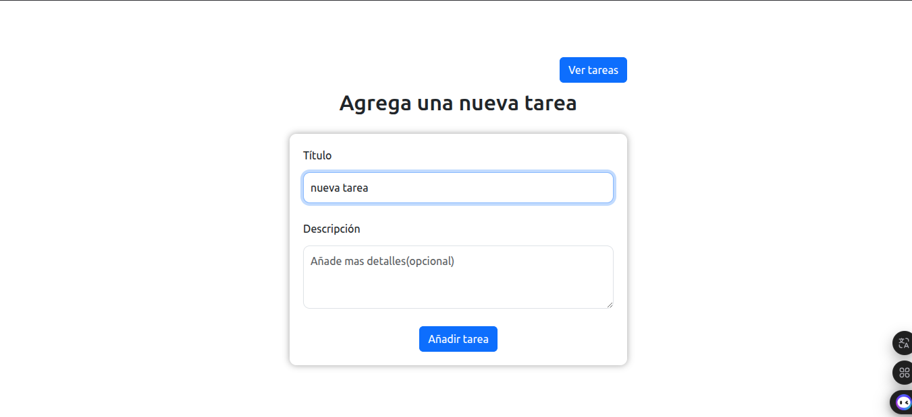
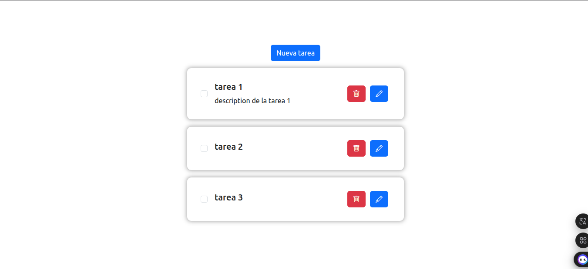
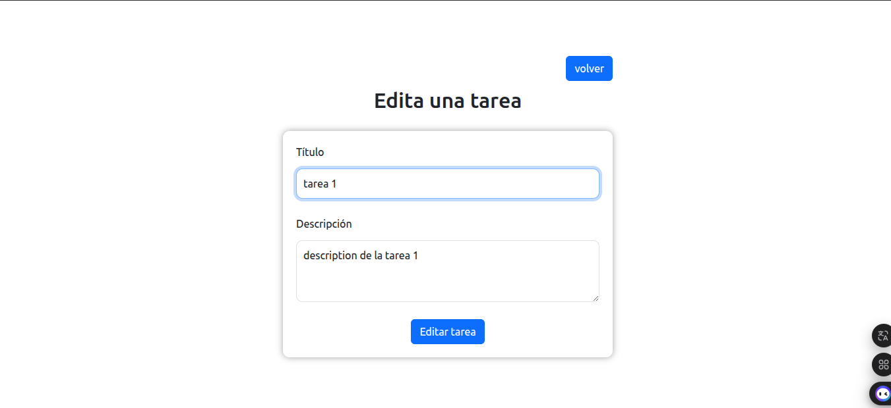

# Challenge - Lista de Tareas 📝

Una aplicación básica de lista de tareas. Permite crear, editar y eliminar tareas de forma simple e intuitiva

## 🛠 Tecnologías utilizadas

- React  
- JavaScript  
- Node.js  
- Express  

## ⚙️ Funcionalidades

- Crear nuevas tareas  
- 📝 Editar tareas existentes  
- ❌ Eliminar tareas  
- ✅ Marcar tareas completadas

## 🖥 Capturas de pantalla





## 🚀 Cómo ejecutar el proyecto localmente

### 1. Clonar el repositorio

```bash
git clone https://github.com/salva5/challenge-forIt.git
cd challenge-forIt
```

### 2. Instalar dependencias del backend

```bash
cd server
npm install
```
### 3. Iniciar el backend

```bash
npm start
```

### 4. Instalar dependencias del frontend

```bash
cd client
npm install
```

### 5. Iniciar el frontend

```bash
npm run dev
```


